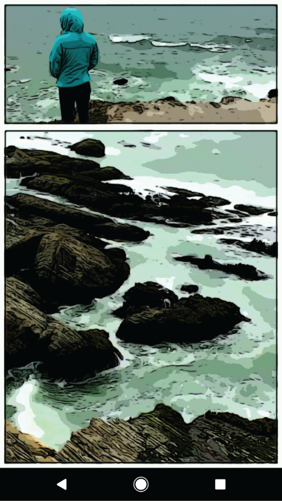
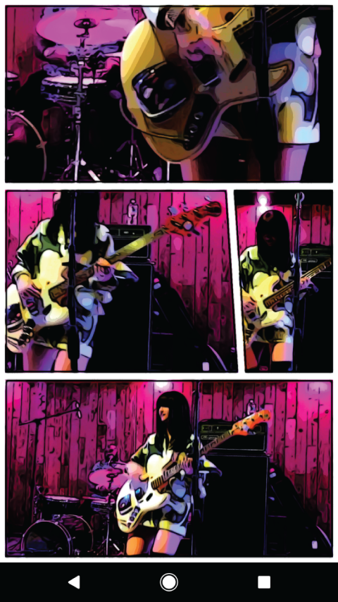
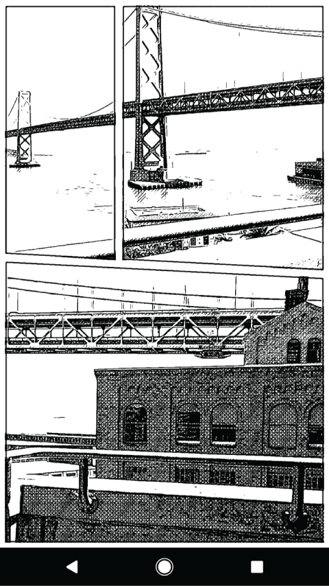
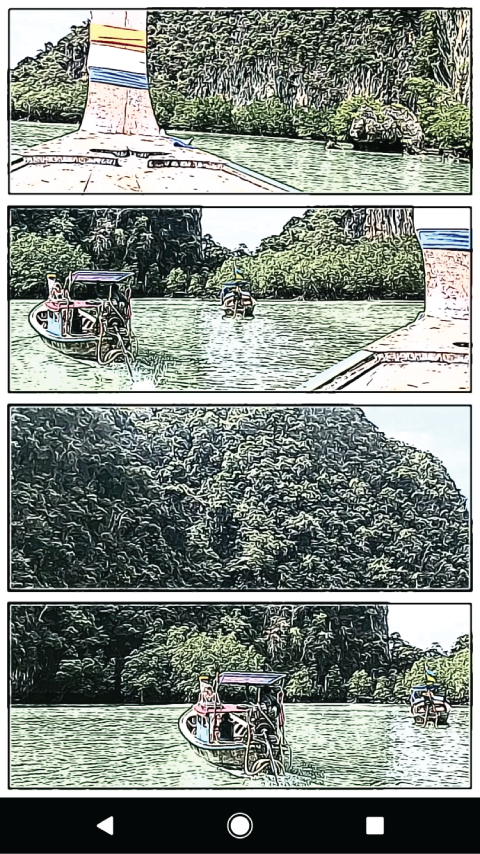
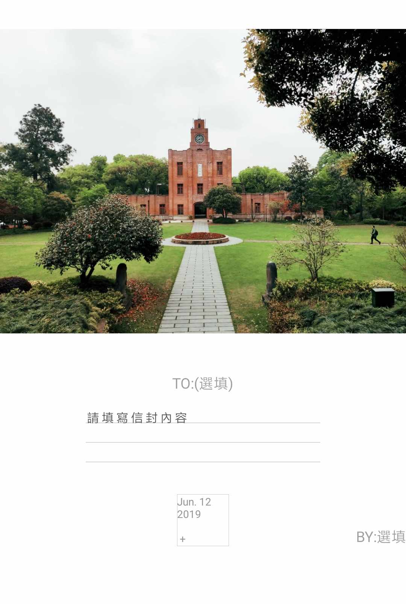
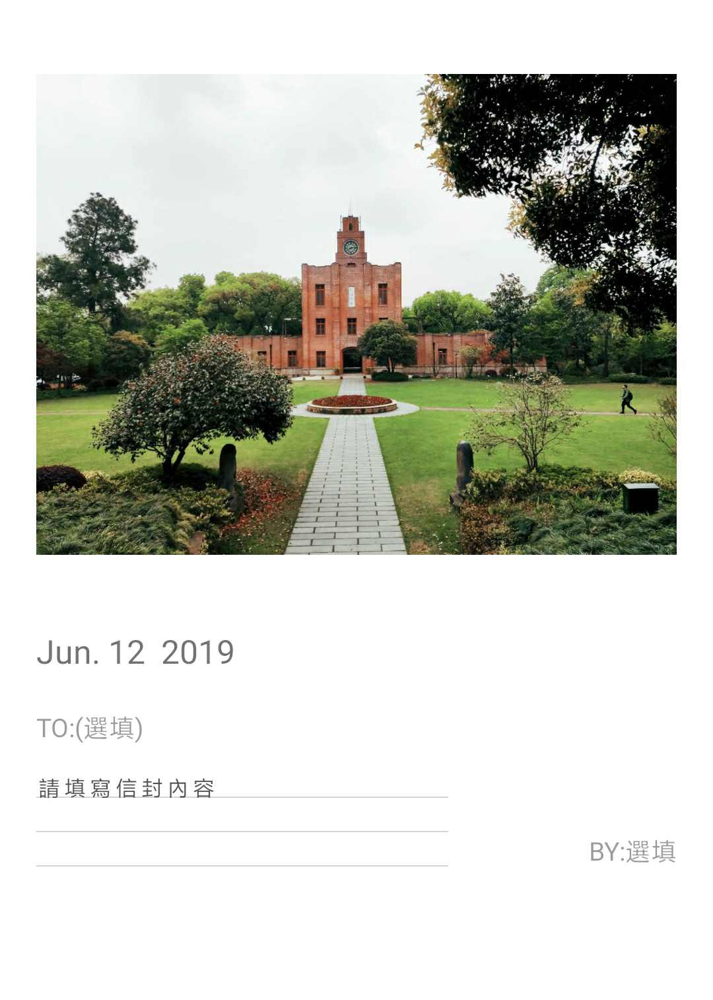

漫品Android客户端

最新版本 下载地址: http://www.aimanpin.com

主要内容为以下三个板块:

#1. 小说模块
(基于客户端本地爬虫对多个网站内容进行爬取,轮训多个站点,找到你喜欢的内容为目的)

1. 基于mvp架构进行代码布局,降低代码耦合度。
2. 采用 sql 数据库对数据进行存储。
4. 支持小说更新提示。
5. 小说阅读提供的功能如下

   * 支持翻页动画:仿真翻页、覆盖翻页、上下滚动翻页等翻页效果。
   * 支持页面定制:亮度调节、背景调节、字体大小调节
   * 支持全屏模式(含有虚拟按键的手机)、音量键翻页
   * 支持页面进度显示、页面切换、上下章切换。
   * 支持在线章节阅读、本地书籍查找。
   * 支持本地书籍加载到页面(支持本地书籍分章、加载速度快、耗费内存少)

**注: 该项目已经上线,市场搜索 漫品 即可下载**

采用了以下开源框架

* [butterknife](https://github.com/JakeWharton/butterknife)    ==>    View注入
* [rxandroid](https://github.com/ReactiveX/RxAndroid)
* [rxjava](https://github.com/ReactiveX/RxJava)
* [greenDAO](https://github.com/greenrobot/greenDAO)    ==>    数据库
* [retrofit](https://github.com/square/retrofit)  ==> 网络
* [Glide](https://github.com/bumptech/glide)    ==>    图片加载

ps:小说模块本站展示内容均来自网络,如有侵权请联系删除,本站只做技术学习,切勿作为商业使用

目前漫品客户端支持小说网站:

- [ABC小说网](https://www.yb3.cc)
- [九桃小说](https://www.9txs.com)
- [塔读文学](http://www.tadu.com)
- [得间小说](https://www.idejian.com)

持续更新中

   

更新记录：
1.8.0
1. 修改书源
2. 优化搜索引擎
3. 优化下载引擎

1.7.5
1. 修复本地图书智能导入功能(优化本地文件查找算法,基于txt文件大小进行排队展示)
2. 修复阅读界面不能保持长亮功能
3. 修复书架界面阅读进度显示错误问题
4. 仿真,覆盖,无三种模式,默认开启音量键翻页
5. 增加单线程缓存章节策略,可用户缓存当前书记内容
6. 基于无翻页模式增加左手滑动模式(基于屏幕两侧(左侧下一页,右侧上一页)(滑动操作与右手模式操作相同,左滑上一页,右滑下一页))

#2. 漫画模块（暂不维护）

基于tensorflow生成漫画,内置3000+种模板,基于人脸识别和目标识别分析等多种手段自动拼接漫画,效果如图:

    

#3. 明信片（暂不维护）

本模块提供多种模板提供用户使用如图,效果如图

    

各个模块架构,实现细节等都会逐步补充,期待你的start

Android开发内容总结,主要针对Android技术,界面,底层,性能优化等方面进行的自我总结

更多技术细节,请参考如下技术总结

[https://androidsummary.gitbook.io/androidsummary/](https://androidsummary.gitbook.io/androidsummary/)
