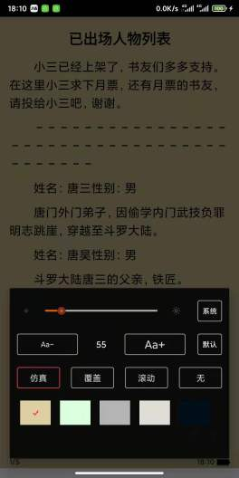
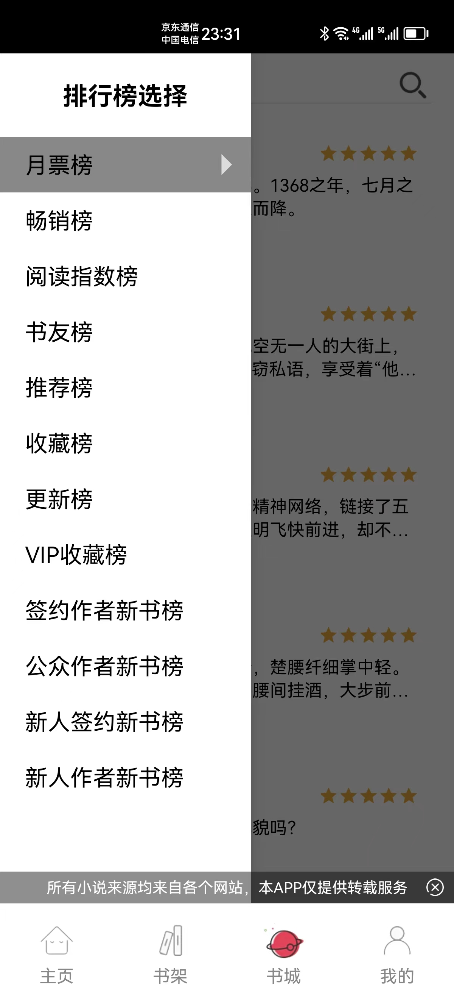

漫品Android客户端

最新版本 下载地址: http://www.aimanpin.com

主要内容为以下三个板块:

#1. 小说模块
(基于客户端本地爬虫对多个网站内容进行爬取,轮训多个站点,找到你喜欢的内容为目的)

1. 基于mvp架构进行代码布局,降低代码耦合度。
2. 采用 sql 数据库对数据进行存储。
4. 支持小说更新提示。
5. 小说阅读提供的功能如下

   * 支持翻页动画:仿真翻页、覆盖翻页、上下滚动翻页等翻页效果。
   * 支持页面定制:亮度调节、背景调节、字体大小调节
   * 支持全屏模式(含有虚拟按键的手机)、音量键翻页
   * 支持页面进度显示、页面切换、上下章切换。
   * 支持在线章节阅读、本地书籍查找。
   * 支持本地书籍加载到页面(支持本地书籍分章、加载速度快、耗费内存少)

采用了以下开源框架

* [butterknife](https://github.com/JakeWharton/butterknife)    ==>    View注入
* [rxandroid](https://github.com/ReactiveX/RxAndroid) ==>响应式框架
* [rxjava](https://github.com/ReactiveX/RxJava) ==>响应式框架
* [greenDAO](https://github.com/greenrobot/greenDAO)    ==>    数据库
* [retrofit](https://github.com/square/retrofit) ==> 网络
* [Glide](https://github.com/bumptech/glide) ==>    图片加载
* [JavaWuzzy](https://github.com/xdrop/fuzzywuzzy) ==> 相似度算法

ps:小说模块本站展示内容均来自网络,如有侵权请联系删除,本站只做技术学习,切勿作为商业使用

目前漫品客户端支持小说网站:

- [ABC小说网](https://www.yb3.cc)
- [九桃小说](https://www.9txs.com)
- [塔读文学](http://www.tadu.com)
- [得间小说](https://www.idejian.com)
- [SoDu小说搜索](http://www.soduzw.com)
- [笔趣阁](https://www.xxbiqudu.com)
- [3040文学](https://www.130140.com)
- [零点小说源](https://www.lingdxsw.com/)

持续更新中

   

更新记录：
1.9.9 (当前版本 发布)
1. 修复 Okhttp跳过https验证 http://jianboge.com/d436237
2. 增加6种排行榜，实时获取全网小说排行
3. 打通排行到阅读流程
4. 下线漫画，明信片模块，降低包体积
5. 优化推荐及图书分发内容
6.bug fix

1.9.8优化(已发布)
1. 修复目录结构错误问题
2. 修复更新提示机制提示错误问题
3. bugfix

1.9.7
1. 优化搜索算法，基于相似度模型进行搜索排序
2. 优化toast弹窗逻辑
3. bugfix

更多版本日志 :

[历史版本日志](app/VERSIONMARK.md)

各个模块架构,实现细节等都会逐步补充,期待你的start

Android开发内容总结,主要针对Android技术,界面,底层,性能优化等方面进行的自我总结

更多技术细节,请参考如下技术总结

[https://androidsummary.gitbook.io/androidsummary/](https://androidsummary.gitbook.io/androidsummary/)
